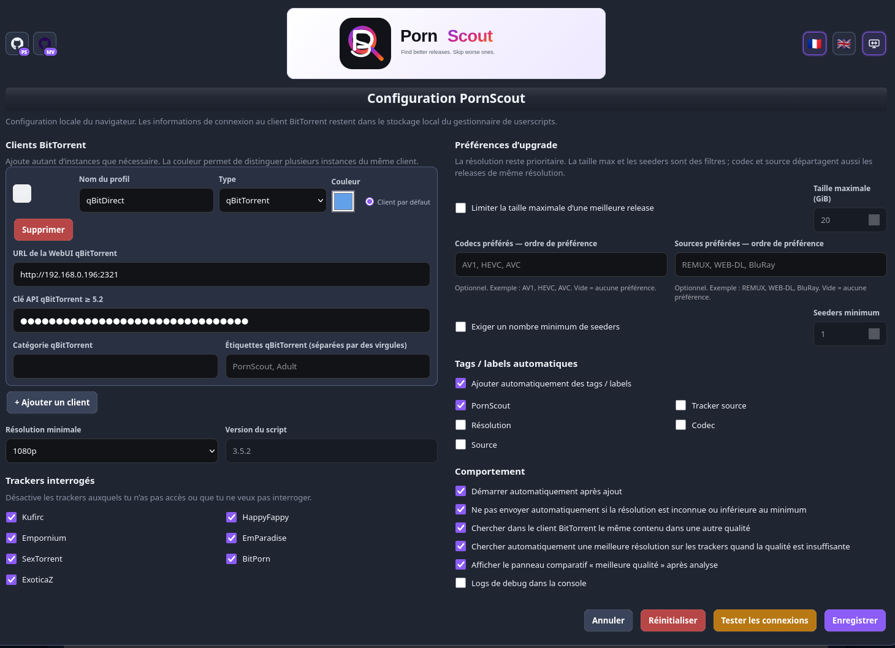
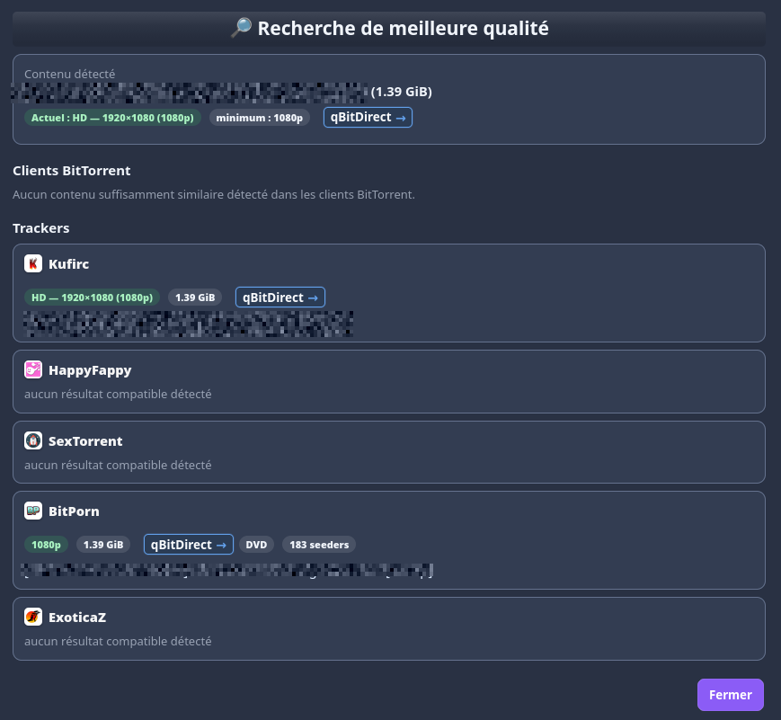
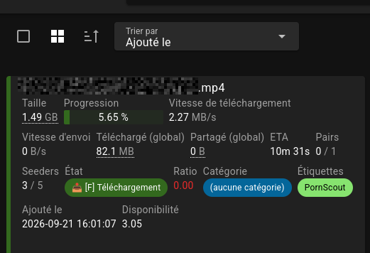

# PornScout

[Version française](README.md)

PornScout is a **Tampermonkey / Violentmonkey** userscript that intercepts `.torrent` downloads, analyzes the current release, searches supported trackers for potentially better alternatives, and sends the selected release to one of your configured BitTorrent clients.

PornScout is not a BitTorrent client, a tracker, or a centralized indexer.

## Screenshots

<table>
<tr>
<td width="50%" align="center"><strong>Configuration</strong> </td>
<td width="50%" align="center"><strong>Release search and selection</strong> </td>
</tr>
<tr>
<td colspan="2" align="center"><strong>Sent to qBitTorrent with the PornScout tag</strong> </td>
</tr>
</table>

## Features

- Intercepts `.torrent` downloads.
- Detects release resolution with a configurable minimum threshold.
- Searches supported trackers for alternative releases.
- Detects resolution, size, codec, source and seeders when available.
- Compares releases with content already present in BitTorrent clients.
- Supports multiple clients and multiple instances of the same client.
- Configurable default client plus manual target selection when sending a release.
- Upgrade preferences: resolution, optional maximum size, preferred codecs, sources and optional minimum seeders.
- Static or dynamic categories / tags / labels (`PornScout`, tracker, resolution, codec, source).
- Trackers can be enabled or disabled individually.
- FR / EN interface and standard / ultrawide layouts.
- Movable floating PornScout button.
- `Ctrl + click` keeps the browser's normal download behavior.

## Supported trackers

- Kufirc
- HappyFappy
- Empornium
- EmParadise
- SexTorrent
- BitPorn
- ExoticaZ

PornScout does not bypass authentication, invitations or access restrictions. To use a private tracker, you must have a valid account, access to that tracker, and an active browser session where PornScout is installed.

## BitTorrent clients

- qBitTorrent
- rTorrent / ruTorrent
- Transmission
- Deluge
- Flood

Multiple profiles can be configured at the same time, including several instances of the same client.

## Installation

1. Install **Tampermonkey** or **Violentmonkey**.
2. Open the [Raw PornScout.user.js](https://raw.githubusercontent.com/Aerya/PornScout/main/PornScout.user.js).
3. Install the userscript.
4. Open PornScout settings.
5. Add at least one BitTorrent client and enable the trackers you use.

## Configuration

The settings popup covers BitTorrent clients, default destination, categories/tags/labels, enabled trackers, minimum resolution, upgrade preferences, automatic tags, language and ultrawide mode.

## Privacy and security

PornScout does not use its own cloud service. Requests are only sent to the trackers you use and the BitTorrent clients you configure. Connection details are stored locally by the userscript manager.

Never publish API keys, cookies, passkeys, tokens, passwords or private URLs containing secrets in a GitHub issue.

## Related project

### MiniVid

[MiniVid](https://github.com/Aerya/MiniVid) is a self-hosted video indexer and player for your adult video library.
